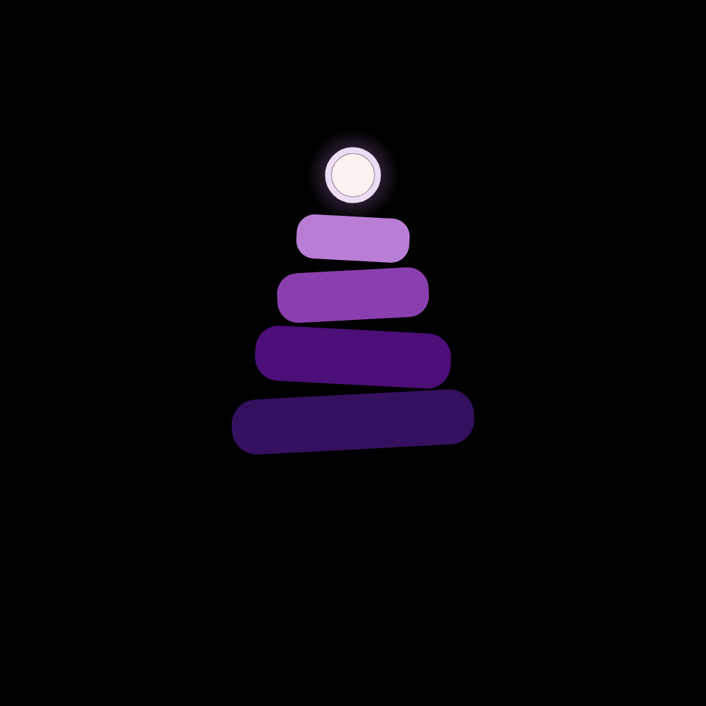
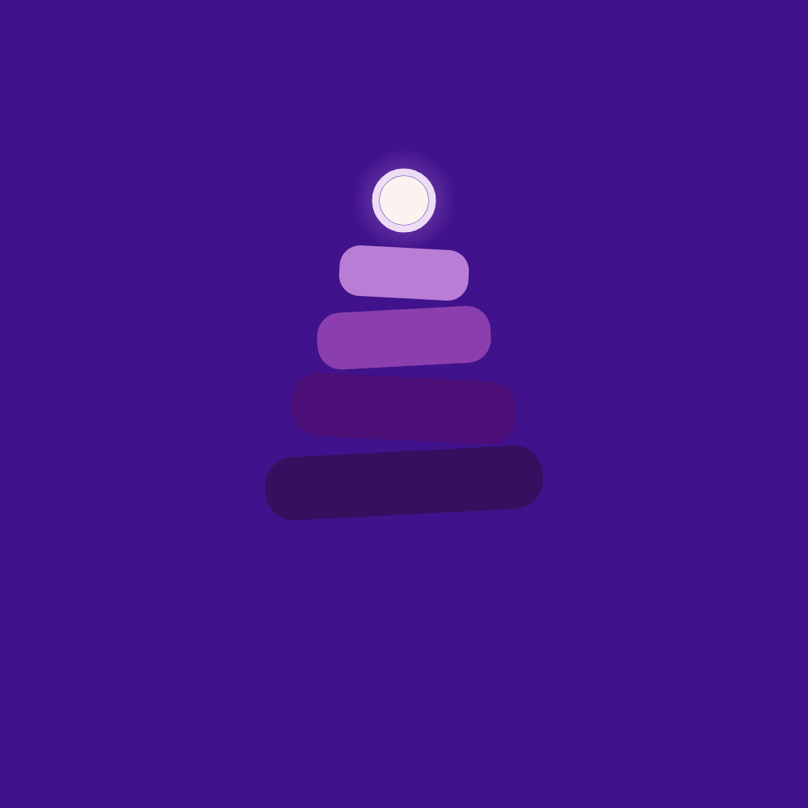

<p align="center">
  
</p>

<h1 align="center">Cairn</h1>

<p align="center">
  <strong>A calm, local-first focus timer, task manager, and habit tracker built on event-sourcing and rock-solid time semantics.</strong>
</p>

<p align="center">
  <a href="https://github.com/blueebeettle/cairn/actions/workflows/ci.yml"></a>
  
  
  
  
  
  
  <a href="LICENSE"></a>
</p>

---

## 🏔️ Overview

A **cairn** is a man-made pile of stones raised as a trail marker or memorial — steady, deliberate, and built one stone at a time.

Most productivity tools suffer from brittle data models, midnight streak resets that punish night owls, confusing reminders, and dishonest statistics that show 0% when nothing was even scheduled.

**Cairn** solves these problems with:
- **Event-Sourced Architecture:** Every user action is an append-only immutable event. History is preserved forever, analytics are mathematically honest, and state can be perfectly reconstructed.
- **Logical Day Rollover (04:00 AM default):** Streaks never reset at midnight. Work done at 1:30 AM counts towards the day you actually experienced.
- **Local-First & Private:** Everything runs locally on device with zero cloud dependency required. Optional backups are end-to-end encrypted with **AES-256-GCM**.

---

## ✨ Features

### ⏱️ 1. Focus Timer & Sessions
- **Interval Flexibility:** Standard Pomodoro or custom focus/break lengths (1–120 minutes).
- **Foreground Service:** Persistent notification with real-time countdown, pause/resume, and complete controls right from the lock screen.
- **Interruption Tracking:** Log internal and external interruptions with honest impact analytics.
- **Session Ratings:** Rate your focus depth and associate sessions with specific projects or tasks.

### ✅ 2. Tasks & Natural Quick Capture
- **Rapid Keyboard Entry:** Powerful syntax parser:
  - `!p1` to `!p4` — Priority levels
  - `#project` — Project tag assignment
  - `~2p` — Estimated Pomodoros (focus sessions)
  - `"fri 5pm"`, `"tomorrow 10am"`, `"oct 4"` — Natural language due dates and times
- **Single-Level Subtasks:** Structured decomposition without infinite nesting sprawl.
- **Recurring Series (RRULE):**
  - **On schedule:** Automatically aligns to fixed schedule dates.
  - **After completion:** Spawns next instance relative to when you actually finish.
- **Tombstoned Deletion:** Soft-deletion with an immediate undo window and clean event logging.

### 🌿 3. Resilient Habit Tracking
- **Rich Scheduling Rules:**
  - Every day
  - Certain weekdays (e.g. Mon, Wed, Fri)
  - Interval (Every $N$ days)
  - Monthly (On the $N$th day)
- **Target Counter Habits:** Track habits requiring multiple daily check-offs (e.g., "8 glasses of water").
- **Streak Shield & Rest Days:** Configure monthly rest day allowances (1–5 days) without breaking your active streak.
- **Interactive Calendar Heatmap:** Year-long grid of daily completions, rest days, and missed dates with reflective notes.

### 📊 4. Honest Statistics & Analytics
- **Card 1 — Summary Metrics:** Total focus minutes, completed sessions, and active days.
- **Card 2 — Peak Productivity Window:** Identifies your most productive hours of the day (gated until 10 sessions are logged).
- **Card 3 & 9 — Activity Heatmaps:** GitHub-style 365-day contribution grids with quantile-based color intensity ramps:
  - *Focus Session Heatmap:* Total focused minutes per day.
  - *Habit Activity Heatmap:* Distinct habits checked off per day.
- **Card 8 — Pooled Habits Leaderboard:** Overall completion rate, total check-offs, and top current streaks across all active habits.
- **Strict "Honest Statistics" Rule:** Rates with zero denominator render as an em dash (`—`), never misleading `0%`.

### 🔔 5. Multi-Reminder Engine & Daily Digest
- **Multiple Reminders Per Item:**
  - Up to 5 countdown offsets per timed task (e.g. at due time, 10 min before, 1 hour before).
  - Up to 5 time-of-day reminders per habit, firing only on scheduled days.
- **Daily Digest:** Configurable morning/evening digest notifications summarizing tasks due today and overdue items.
- **Persistent Notification IDs:** Device-local counter allocation prevents duplicate notification storms or OS ID collisions.

### 🔐 6. Local-First & End-to-End Encryption
- **Encrypted Cloud Backups:** Backup to Supabase Storage or Google Drive.
- **Client-Side Cryptography:** Encrypted with **AES-256-GCM** using PBKDF2 key derivation (100,000 iterations), unique salt, and initialization vectors.
- **Zero-Knowledge:** Passphrase is never transmitted or stored remotely.

---

## 🎨 Design & Palette

Cairn follows a warm, earthy, pebble-and-mineral palette with high contrast ratios designed to reduce eye strain:

<p align="center">
  
  &nbsp;&nbsp;
  
  &nbsp;&nbsp;
  
</p>

| Token | Hex | Role | Contrast Ratio |
|---|---|---|---|
| **Brand Purple** | `#590D86` | Primary brand accent & ground | `10.5:1` |
| **Dark Ground** | `#17111C` | Dark theme surface background | `16.9:1` |
| **AMOLED Black** | `#000000` | True black for OLED power efficiency | `19.1:1` |
| **Cream** | `#FAF3F0` | Primary text and stone surfaces | `10.5:1` |
| **Lavender** | `#BA7DD6` | Top stone cap accent & highlights | `3.8:1` |

---

## ⌨️ Quick Capture Syntax

From the quick-capture modal (`+`), you can type naturally:

```text
Review Q3 roadmap !p1 #work ~3p "tomorrow 3pm"
Read 25 pages of Dune !p3 ~1p "fri 9pm"
File tax return !p2 "oct 15"
Buy groceries #errands
```

| Token | Meaning | Example |
|---|---|---|
| `!p1` – `!p4` | Priority level (p1 urgent to p4 low) | `!p1` |
| `#tag` | Project / category tag | `#work`, `#personal` |
| `~Np` | Estimated pomodoros | `~2p` (2 focus sessions) |
| `"..."` | Quoted due date / time | `"today 5pm"`, `"mon 9am"`, `"nov 1"` |

---

## 🏗️ Architecture

```
lib/
├── core/
│   ├── constants/       # Event types, recurrence enums, notification bands
│   ├── crypto/          # AES-256-GCM client-side encryption engine
│   ├── habits/          # Pure streak calculation engine & RRULE parsing
│   ├── stats/           # Database-free stats engine (focus & habits)
│   └── time/            # TimeService, logical day offset & timezone logic
├── data/
│   ├── database/        # Drift database, schema tables & migrations
│   ├── providers/       # Riverpod dependency injection & streams
│   └── repositories/    # Event-sourced repositories (Tasks, Habits, Reminders)
└── features/
    ├── backup/          # Supabase & Google Drive encrypted sync
    ├── habits/          # Habit tracking, streak badges, month grid
    ├── reminders/       # Notification service & daily digest reconcile
    ├── stats/           # 9-card analytics dashboard & heatmaps
    ├── tasks/           # Task list, quick capture & detail sheet
    └── timer/           # Foreground focus timer service & controls
```

### Event-Sourcing Guarantee
```
User Action ──▶ Write to `events` (Append-Only) ──▶ Project to Read Tables (`tasks`, `habits`)
```
No row in `events` is ever updated or deleted. Replays reconstruct state deterministically.

---

## 🚀 Getting Started

### Prerequisites
- [Flutter SDK](https://flutter.dev/docs/get-started/install) (`>= 3.24.0`)
- Android Studio / VS Code with Flutter extension
- An Android device or emulator (API 26+)

### 1. Clone the repository
```bash
git clone https://github.com/blueebeettle/cairn.git
cd cairn
```

### 2. Install dependencies
```bash
flutter pub get
```

### 3. Generate Database Models (Drift)
```bash
dart run build_runner build --delete-conflicting-outputs
```

### 4. Run Static Analysis & Tests
```bash
flutter analyze
flutter test
```

### 5. Launch the Application
```bash
# Run on connected Android device or desktop
flutter run
```

---

## 🧪 Testing

Cairn maintains a comprehensive test suite of **389 tests** covering:
- **Unit tests:** Timezone shifts, DST transitions, logical day boundaries, and recurrence algorithms.
- **Repository integration tests:** Drift in-memory transactions, event replay, and monotonic notification ID counters.
- **Widget & Accessibility tests:** 200% font scale layout validation without overflow across all screens.

Run specific test modules:
```bash
# Reminders and notification tests
flutter test test/reminders_feature_test.dart

# Habit engine & pooled stats tests
flutter test test/habit_statistics_test.dart
flutter test test/habits_feature_test.dart

# 200% accessibility font scale audit
flutter test test/font_scale_200_audit_test.dart
```

---

## 🏛️ Architecture & Standards

Cairn is engineered with strict domain boundaries and architectural guarantees:

- **Event-Sourced Ledger**: User actions append immutable entries to the `events` table; projections are rebuilt deterministically.
- **Strict Time Semantics**: Logical day rollover occurs at `04:00 AM` by default. Timestamps use UTC epoch milliseconds with explicit timezone offsets.
- **Honest Statistics**: Metrics never report `0%` when the denominator is zero, distinguishing true absence of data from positive zero.
- **Accessibility**: All screens and dialogs are verified to scale cleanly at 200% text scale with zero layout overflow.

---

## 🤝 Contributing & Community

Contributions are welcome! Please check our community guidelines before getting started:
- [**Contributing Guide**](CONTRIBUTING.md) — Development setup, code generation, and pull request guidelines.
- [**Code of Conduct**](CODE_OF_CONDUCT.md) — Community standards and pledge.
- [**Security Policy**](SECURITY.md) — Vulnerability reporting and encryption disclosure process.

---

## 📄 License

This project is licensed under the [MIT License](LICENSE).

